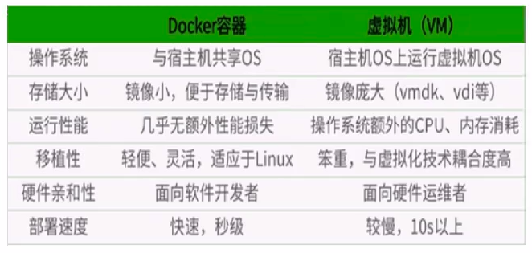
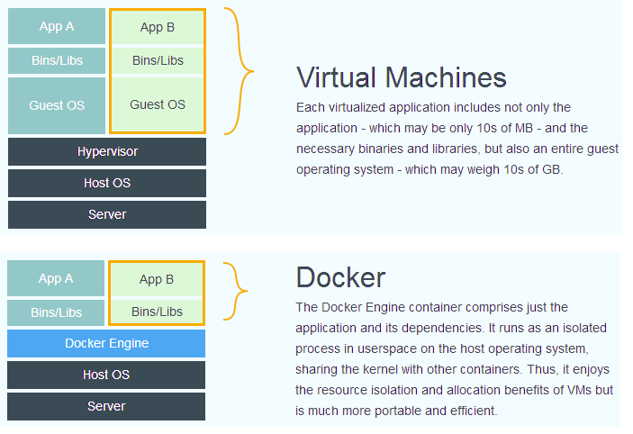

1、docker与vm 虚拟机的比较





２、docker常用命令

帮助命令：

`docker version`　`docker info`　`docker --help`

镜像命令：

`docker images -a` 　列出本地所有镜像

`docker search xxImage`　搜索镜像

 `docker pull xxImage`　拉取镜像

 `docker rmi xxImage` 删除镜像。如果该镜像曾经在容器中运行过，需要先删除相关容器才可以删除镜像

容器命令：

`docker run [options] xxImage [command]` 新建并启动容器

```shell
docker run -it xxImage  # 交互式运行容器
```

`docker start containerID/containerName` 启动已停止的容器

`docker restart containerID/containerName` 重启已创建的容器

`docker stop containerID/containerName` 停止容器

`docker kill containerID/containerName` 强制停止容器

`docker ps` 列出正在运行的容器信息

`docker rm containerID` 删除容器

`exit` 退出容器，并停止容器

`ctrl + p + q` 退出容器，容器不停止

`docker run -d xxImage` 后台运行容器。如果容器中没有前台应用运行，容器会直接退出，docker ps不会存在该容器

`docker logs containerID`　查看容器日志

`docker top containerID`  查看容器中运行的进程

`docker inspect containerID` 　查看容器运行信息

`docker exec -it containerID　command　`　在正在运行的容器中执行命令，并返回结果。

`docker attach containerID` 重新进入到正在运行容器中

`docker cp containerID:/XX/YY路径　宿主机路径`　拷贝容器中的文件到宿主机

3、docker 镜像原理

docker镜像是只读的

docker 是一个联合文件系统（UnionFS）,实际上是一层层的文件系统，但是从外面看只有一个文件系统。

bootfs: boot加载器和kernel，不同的发行版系统可以使用相同的bootfs

rootfs: 不同发行版系统的文件系统，包括/dev,/root,/etc等

分层的结构可以共享资源，不同的镜像可以共用都使用到的分层文件，并且在内存中只加载一份。

镜像制作：`docker commit -m="信息"　-a="作者"　容器ID　目标镜像名:XXTag` 


4、docker 容器数据卷和数据卷容器

容器中运行的数据持久化，容器之间共享数据，主机与容器之间的数据传递

容器内添加数据卷：

- `docker run -it -v 宿主机目录:容器目录　容器名`

- DockerFile中添加

  １、编写dockerfile文件

  ```dockerfile
  FROM centos
  # 添加的目录是容器内的数据卷路径，宿主机的路径自动生成
  VOLUME ["/data/cd1", "/data/cd2"]
  CMD echo "--add volume finished--"
  CMD /bin/bash
  ```

  ２、生成镜像，运行容器

  ```shell
  docker build xxDockerFile
  docker build -t xxName:Tag .
  ```

  3、查看宿主机的卷路径

  ```shell
  docker inspect containerID　
  ```

  

附加数据卷操作权限：`docker run -it -v 宿主机目录:容器目录:文件夹操作权限　容器名`　

文件夹操作权限：ro ＝read only

查看容器信息：`docker inspect containerID`

**不论容器是否运行或者停止，对数据卷的修改都能同步**

> 已运行的容器还能添加容器数据卷吗？

容器数据卷：从其他容器继承数据卷，不同容器之间共用相同的数据卷。只要有容器在使用，数据卷就一直有效

`docker run -it --volumes-form xxContainerID/xxContainerName xxImage`


4、DockerFile文件编写

用于构建Docker镜像的文件，由一系列命令和参数构成

> 规则
>
> - 指令必须全为大写，并至少跟一个参数
>   1. `FROM`　当前镜像的父镜像、基础镜像
>   2. `MAINTAINER` 　镜像作者信息
>   3. `RUN`　构建镜像过程中额外的命令
>   4. `EXPOSE`　当前容器对外暴露的端口
>   5. `WORKDIR`　登录后的工作目录
>   6. `ENV`　设置环境变量，可在其他指令中使用
>   7. `ADD`　拷贝和解压缩
>   8. `COPY src dst` `COPY {"src", "dst"}`　拷贝
>   9. `VOLUME`　创建容器数据卷
>   10. `CMD` 可以有多个CMD命令，但启动后最终只会处于最后一条命令的执行结果中，会覆盖之前执行过的命令
>   11. `ENTRYPOINT`　与CMD命令相似，但是多个命令可以作为前面命令的参数附加上去
>   12. `ONBUILD`　父镜像在子镜像构建时触发的指令
> - 命令从上往下，顺序执行，＃表示注释
> - 每执行一条指令，对镜像进行一次修改提交


docker 原始的基础镜像名：`scratch`

编译指令：`docker build -f xxDockerfile -t xxImage .` 　

创建centos Dockerfile:

案例１

```dockerfile
# centos
# 功能：
# 1. 安装vim net-tools
# 2. 运行后进入的目录：/usr/local
# 3. 端口暴露：80

FROM centos
MAINTAINER dlg<dlg@qq.com

ENV ENTRY_PATH /usr/local　# 添加环境变量
WORKDIR $ENTRY_PATH　# 设置进入容器后的工作目录

RUN yum -y install vim	# 安装系统工具
RUN yum -y install net-tools

EXPOSE 80　# 端口暴露

CMD echo "--build finished--"
CMD /bin/bash　# 容器启动后的运行命令

```

案例二

```dockerfile
# centos
# CMD 和 ENTRYPOINT　对比
FROM centos

CMD curl http://www.baidu.com
```

```dockerfile
# centos
FROM centos

ENTRYPOINT ["curl","-s","http://www.baidu.com"] # 这种形式才能生效，才能正确传递参数
```

案例三

```dockerfile
#　自定义Tomcat
#	功能：
# 1. 放置jdk文件，配置jdk环境
# 2. 放置tomcat文件，配置tomcat环境
# 3. 设置工作目录　/usr/local
# 4. 映射容器数据卷包括tomcat的webapps和logs目录(运行容器时执行)
# 5. 容器运行时启动tomcat，并打印日志

FROM centos

ENV WORK_DIR /usr/local
WORKDIR $WORK_DIR

ADD ./jdk-8u11-linux-x64.tar.gz /usr/local 
ADD ./apache-tomcat-9.0.30.tar.gz /usr/local

ENV JAVA_HOME /usr/local/jdk1.8.0_11
ENV JRE_HOME /usr/local/jdk1.8.0_11/jre
ENV CLASSPATH $JAVA_HOME/lib/dt.jar:$JAVA_HOME/lib/tools.jar
ENV CATALINA_HOME /usr/local/apache-tomcat-9.0.30
ENV CATALINA_BASE /usr/local/apache-tomcat-9.0.30
ENV PATH $PATH:$JAVA_HOME/bin:$CATALINA_HOME/lib:$CATALINA_HOME/bin

EXPOSE 8080

CMD /usr/local/apache-tomcat-9.0.30/bin/startup.sh && tail -f /usr/local/apache-tomcat-9.0.30/logs/catalina.out

```

 

5、常用容器安装和使用

安装mysql容器

安装redis容器

安装nginx容器

...

